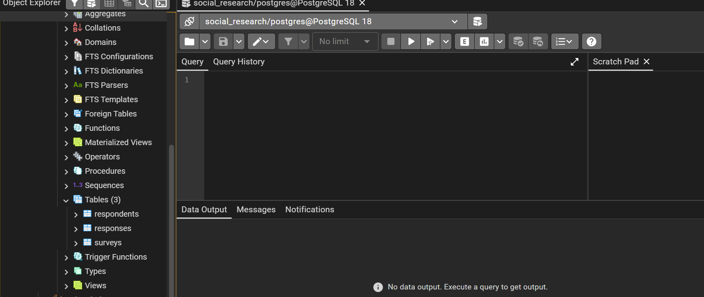
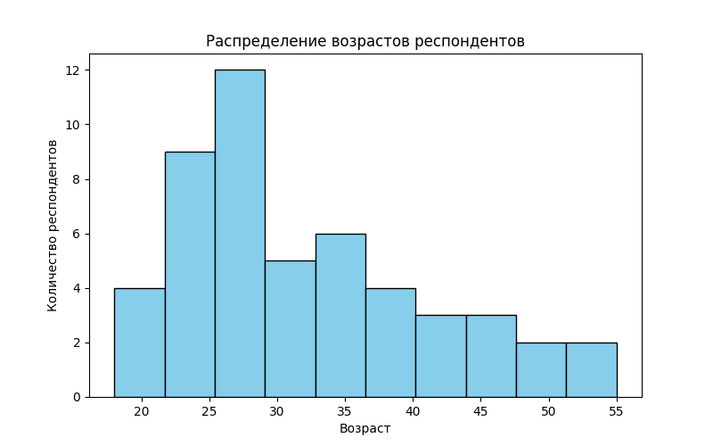
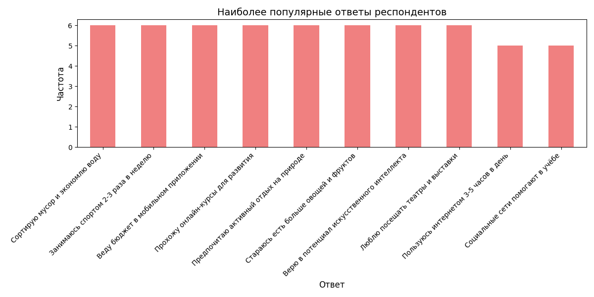

```markdown
# Рубежный контроль №1

## Проект: База данных для социологических опросов

**Выполнили:** Ранюк Никита, Балашова Олеся  
**Группа:** СГН2-61Б

---

## 📋 Содержание

1. Описание проекта
2. Структура базы данных
3. Последовательность выполнени
4. Результаты работы
5. Заключение

---

## 1. 📝 Описание проекта

Данный проект представляет собой систему для хранения и анализа данных социологических опросов. Проект включает:

- Создание базы данных PostgreSQL
- Разработку структуры таблиц с обеспечением целостности данных
- Загрузку данных из CSV-файлов
- Визуализацию результатов анализа

---

## 2.🗄️ Структура базы данных

### Таблица `respondents` (Респонденты)

Хранит информацию об участниках опросов:

| Поле | Тип | Описание | Ограничения |
|------|-----|----------|-------------|
| id | SERIAL | Уникальный идентификатор | PRIMARY KEY |
| name | TEXT | Имя респондента | NOT NULL |
| age | INT | Возраст | CHECK (age > 0) |
| city | TEXT | Город проживания | - |
| gender | TEXT | Пол | CHECK (gender IN ('Male', 'Female')) |

### Таблица `surveys` (Опросы)

Содержит информацию о проводимых исследованиях:

| Поле | Тип | Описание | Ограничения |
|------|-----|----------|-------------|
| id | SERIAL | Уникальный идентификатор | PRIMARY KEY |
| name | TEXT | Название опроса | NOT NULL |
| date | DATE | Дата проведения | - |
| topic | TEXT | Тема опроса | - |

### Таблица `responses` (Ответы)

Хранит ответы респондентов:

| Поле | Тип | Описание | Ограничения |
|------|-----|----------|-------------|
| id | SERIAL | Уникальный идентификатор | PRIMARY KEY |
| respondent_id | INT | Ссылка на респондента | FOREIGN KEY, ON DELETE CASCADE |
| survey_id | INT | Ссылка на опрос | FOREIGN KEY, ON DELETE CASCADE |
| answer | TEXT | Текст ответа | NOT NULL |

---

## 3.🔧 Последовательность выполнения

### Шаг 1: Создание виртуального окружения

```bash
python -m venv .venv
.venv\Scripts\activate
```

### Шаг 2: Установка необходимых библиотек

```bash
pip install psycopg2 pandas matplotlib
```

**Используемые библиотеки:**
- `psycopg2` — драйвер для подключения к PostgreSQL
- `pandas` — работа с данными и SQL-запросами
- `matplotlib` — визуализация данных

### Шаг 3: Создание базы данных в PostgreSQL

1. Открыть **pgAdmin**
2. Создать новую базу данных `social_research`
3. Выполнить SQL-запросы для создания таблиц:

```sql
CREATE TABLE respondents (
    id SERIAL PRIMARY KEY,
    name TEXT NOT NULL,
    age INT CHECK (age > 0),
    city TEXT,
    gender TEXT CHECK (gender IN ('Male', 'Female'))
);

CREATE TABLE surveys (
    id SERIAL PRIMARY KEY,
    name TEXT NOT NULL,
    date DATE,
    topic TEXT
);

CREATE TABLE responses (
    id SERIAL PRIMARY KEY,
    respondent_id INT NOT NULL,
    survey_id INT NOT NULL,
    answer TEXT NOT NULL,
    FOREIGN KEY (respondent_id) REFERENCES respondents(id) ON DELETE CASCADE,
    FOREIGN KEY (survey_id) REFERENCES surveys(id) ON DELETE CASCADE
);
```

### Шаг 4: Подготовка CSV-файлов

Созданы три файла с данными:

**respondents.csv** — информация о 50 респондентах следующего вида:
```csv
id,name,age,city,gender
1,Иван Иванов,25,Москва,Male
2,Анна Смирнова,30,Санкт-Петербург,Female
3,Петр Сидоров,22,Новосибирск,Male
4,Елена Орлова,27,Казань,Female
5,Алексей Волков,35,Екатеринбург,Male
```

**surveys.csv** — данные о 10 опросах следующего вида:
```csv
id,name,date,topic
1,Исследование цифровых привычек,2024-02-10,Цифровая грамотность
2,Опрос по экологии,2024-03-15,Экологическая осведомленность
3,Социальные сети и молодёжь,2024-04-05,Влияние соцсетей
```

**responses.csv** — ответы респондентов следующего вида:
```csv
id,respondent_id,survey_id,answer
1,1,1,"Пользуюсь интернетом 5 часов в день"
2,2,1,"Использую социальные сети для работы"
3,3,2,"Сортирую мусор и экономлю воду"
4,4,3,"Социальные сети помогают учёбе"
5,5,3,"Я ограничиваю время в социальных сетях"
```

### Шаг 5: Загрузка данных в базу данных

**Файл:** `add_data.py`

**Описание:** Скрипт считывает данные из CSV-файлов и загружает их в таблицы PostgreSQL.

**Ключевые функции:**
- Подключение к базе данных с параметрами:
  - dbname: `social_research`
  - user: `postgres`
  - host: `localhost`
  - port: `5432`
- Функция `load_csv_to_db()` загружает данные из CSV в указанную таблицу
- Автоматическое формирование SQL-запросов INSERT

**Запуск:**
```bash
python add_data.py
```

**Результат:** 
```
Данные успешно загружены в базу!
```

### Шаг 6: Анализ возрастного распределения респондентов

**Файл:** `age_distribution.py`

**Описание:** Скрипт строит гистограмму распределения возрастов респондентов.

**Алгоритм работы:**
1. Подключение к базе данных
2. Выполнение SQL-запроса: `SELECT age FROM respondents`
3. Загрузка данных в DataFrame pandas
4. Построение гистограммы с параметрами:
   - Количество бинов: 10
   - Цвет: skyblue
   - Размер фигуры: 8x5 дюймов

**Запуск:**
```bash
python age_distribution.py
```

### Шаг 7: Анализ популярных ответов

**Файл:** `popular_responses.py`

**Описание:** Скрипт определяет и визуализирует наиболее часто встречающиеся ответы.

**Алгоритм работы:**
1. Подключение к базе данных
2. Выполнение SQL-запроса: `SELECT answer FROM responses`
3. Подсчет частоты ответов с помощью `value_counts()`
4. Построение столбчатой диаграммы:
   - Тип графика: bar
   - Цвет: lightcoral
   - Размер фигуры: 12x6 дюймов
   - Поворот подписей: 45 градусов

**Запуск:**
```bash
python popular_responses.py
```

---

## 4.📊 Результаты работы

### 1. Структура базы данных в pgAdmin



---


### 2. Гистограмма распределения возрастов

**Описание:** График показывает распределение респондентов по возрастным группам.



**Анализ:**
- Наиболее представленная группа — 26–30 лет (28% выборки)
- Молодёжь до 25 лет составляет 26% респондентов
- Респонденты старше 40 лет 20% выборки
- Распределение имеет правостороннюю асимметрию: преобладает молодая и средняя возрастная группа

---

### 3. Диаграмма популярных ответов

**Описание:** График отображает наиболее часто встречающиеся ответы респондентов.



**Анализ:**
- Позитивные поведенческие паттерны:
    - Экологическая осознанность (сортировка мусора, экономия ресурсов)
    - Забота о здоровье (спорт, питание, режим)
    - Финансовая дисциплина (ведение бюджета, планирование)
    - Стремление к развитию (онлайн-курсы, профессиональная литература)
- Отношение к технологиям:
    - Оптимистичный взгляд на ИИ и инновации
    - Осознанное использование соцсетей (баланс пользы и ограничений)
- Культурные предпочтения:
    - Активный отдых и туризм по России
    - Интерес к театру, литературе, классической музыке

---

## 💡 Технические особенности

## 🔧 Требования

- **Python:** 3.8 или выше
- **PostgreSQL:** 12 или выше
- **pgAdmin:** для визуального управления БД

**Зависимости Python:**
```
psycopg2-binary==2.9.9
pandas==2.1.4
matplotlib==3.8.2
```

---

## 5. 📝 Заключение

В ходе выполнения рубежного контроля №1 было реализовано:

1. ✅ Спроектирована реляционная база данных для социологических опросов
2. ✅ Обеспечена целостность данных через ограничения и внешние ключи
3. ✅ Реализована загрузка данных из CSV-файлов с помощью Python
4. ✅ Проведён анализ данных с визуализацией результатов
5. ✅ Продемонстрирована работа с PostgreSQL через pgAdmin и psycopg2

**Полученные навыки:**
- Проектирование баз данных
- Работа с SQL (DDL, DML)
- Интеграция Python с PostgreSQL
- Визуализация данных с matplotlib
- Обработка данных с pandas

---

## 👥 Авторы

- **Ранюк Никита** — СГН2-61Б
- **Балашова Олеся** — СГН2-61Б

**Дата выполнения:** 2024

